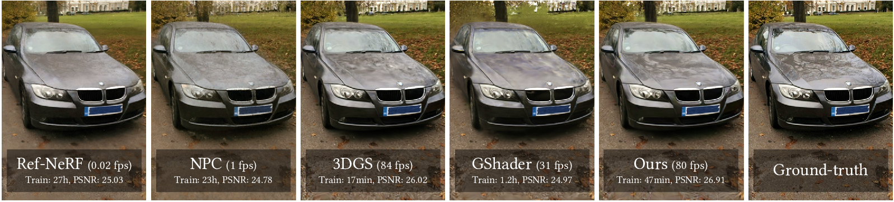

# 3D Gaussian Splatting with Deferred Reflection
Keyang Ye, Qiming Hou, Kun Zhou<br>
| [Webpage](https://xxx) | [Full Paper](https://xxx) |<br>


This repository contains the official authors implementation associated with the paper "3D Gaussian Splatting with Deferred Reflection", which can be found [here](https://repo-sam.inria.fr/fungraph/3d-gaussian-splatting/).

Abstract: *The advent of neural and Gaussian-based radiance field methods have achieved great success in the field of novel view synthesis. However, specular reflection remains non-trivial, as the high frequency radiance field is notoriously difficult to fit stably and accurately. We present a deferred shading method to effectively render specular reflection with Gaussian splatting. The key challenge comes from the environment map reflection model, which requires accurate surface normal while simultaneously bottlenecks normal estimation with discontinuous gradients. We leverage the per-pixel reflection gradients generated by deferred shading to bridge the optimization process of neighboring Gaussians, allowing nearly correct normal estimations to gradually propagate and eventually spread over all reflective objects. Our method significantly outperforms state-of-the-art techniques and concurrent work in synthesizing high-quality specular reflection effects, demonstrating a consistent improvement of peak signal-to-noise ratio (PSNR) for both synthetic and real-world scenes, while running at a frame rate almost identical to vanilla Gaussian splatting.*

<section class="section" id="BibTeX">
  <div class="container is-max-desktop content">
    <h2 class="title">BibTeX</h2>
    <pre><code>@Article{xxx,
      author       = {xxx},
      title        = {3D Gaussian Splatting with Deferred Reflection},
}</code></pre>
  </div>
</section>


## Funding and Acknowledgments

XXXXXXX.

## Installation
First, please follow the setup tutorial of vanilla [3DGS](https://github.com/graphdeco-inria/gaussian-splatting), and ensure you can run their code. Then, install the following submodules to run our code.

```
pip install submodules/cubemapencoder
pip install submodules/diff-gaussian-rasterization_c3
pip install submodules/diff-gaussian-rasterization_c7
pip install submodules/simple-knn
```
`diff-gaussian-rasterization_c3` and `simple-knn` are identical to the vanilla 3DGS. You can skip them if you have installed them.

## Datasets
We mainly test our method on [Shiny Blender Synthetic](https://storage.googleapis.com/gresearch/refraw360/ref.zip), [Shiny Blender Real](https://storage.googleapis.com/gresearch/refraw360/ref_real.zip), [Glossy Synthetic](https://liuyuan-pal.github.io/NeRO/) and [NeRF Synthetic dataset](https://drive.google.com/drive/folders/128yBriW1IG_3NJ5Rp7APSTZsJqdJdfc1). Please run the script `nero2blender.py` to convert the format of the Glossy Synthetic dataset.

You can create links as follows:
```
mkdir data
ln -s PATH_TO_DATASET data
```

## Running
We provide the script to test our code on each scene of datasets. Just run:
```
sh train.sh
```
You may need to modify the path in `train.sh`

<details>
<summary><span style="font-weight: bold;">Command Line Arguments for train.py</span></summary>

  #### --longer_prop_iter
  More iterations for normal propagation. If you find the default configuration cannot perform normal propagation well, set --longer_prop_iter 24_000 or more. Default: 0

  #### --opac_lr0_interval
  For faster normal propagation, leave it as default: 200. But sometimes the default value may lead to instability or low quality. Set it to 0 and set `longer_prop_iter` to 36_000 or more for better quality.

  #### --densification_interval_when_prop
  Densification interval when normal propagation. Set it to 100 when the scene mainly contains rough objects. Default: 500

  #### --use_env_scope
  For real scenes, add this command to eliminate the impact of background. `env_scope_center` and `env_scope_radius` represent a sphere domain where the environment light takes effect.

  #### --env_scope_center and --env_scope_radius
  The center and radius of the sphere domain.
  
</details>
<br>


## Evaluation
```
python eval.py --model_path output/NAME_OF_THE_SCENE
```
You will get PSNR/SSIM/LPIPS/FPS results.
If you need to save image and lighting results, add argument `--save_images`

We have further optimized our code. Now the training time is about **10min** on synthetic datasets and **30min** on real-world dataset. The average FPS is **500+** on synthetic datasets and **200+** on real-world datasets. (We test on RTX 4090 GPU)

## Viewer
We provide a simple gui viewer based on `dearpygui`. Please install it first.
```
pip install dearpygui
```
Then run the server:
```
python net_viewer.py --model_path output/NAME_OF_THE_SCENE
```
Run the client:
```
cd net_viewer_client
python net_viewer.py
```

## Custom real-world dataset
For better novel view synthesis quality, you may need to provide a spherical domain where the environment lighting takes effect. The simplest approach is to import the initial point cloud into Blender, add a sphere to cover the main reflective objects, and use the center and radius of this sphere as training parameters (for details, refer to 'Command Line Arguments for train.py').